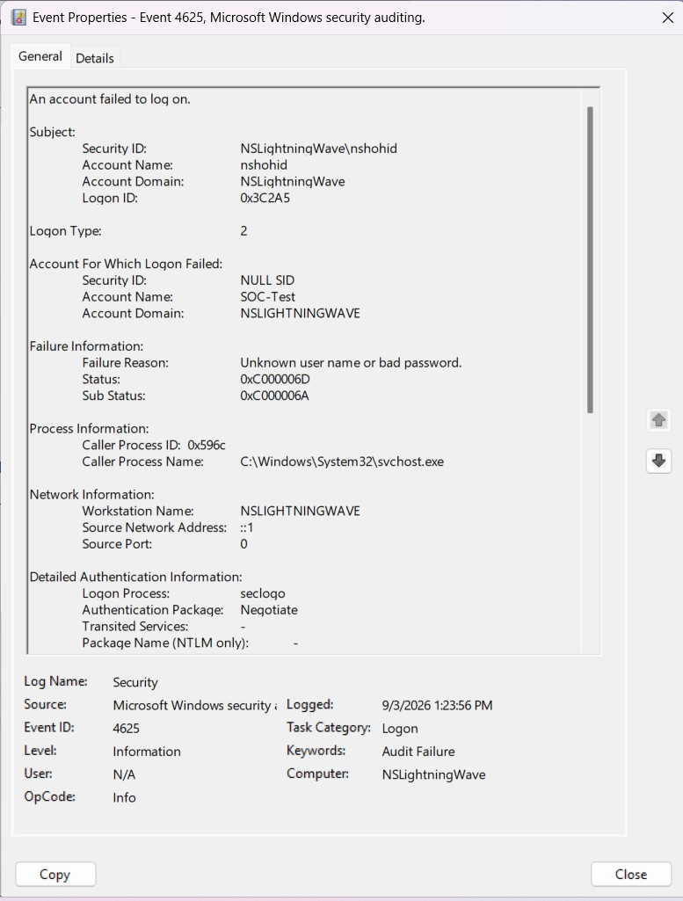
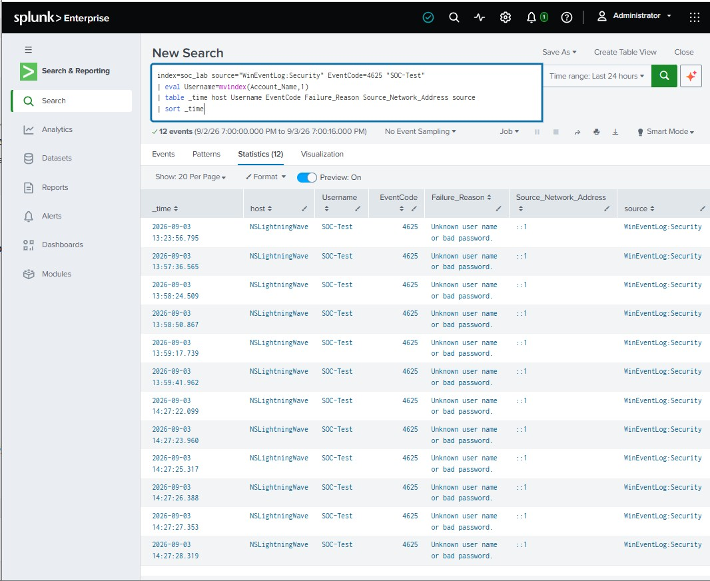
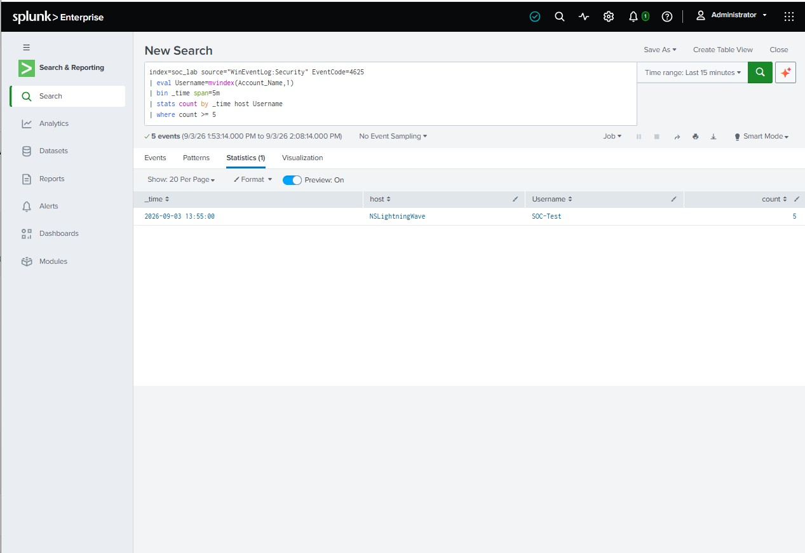
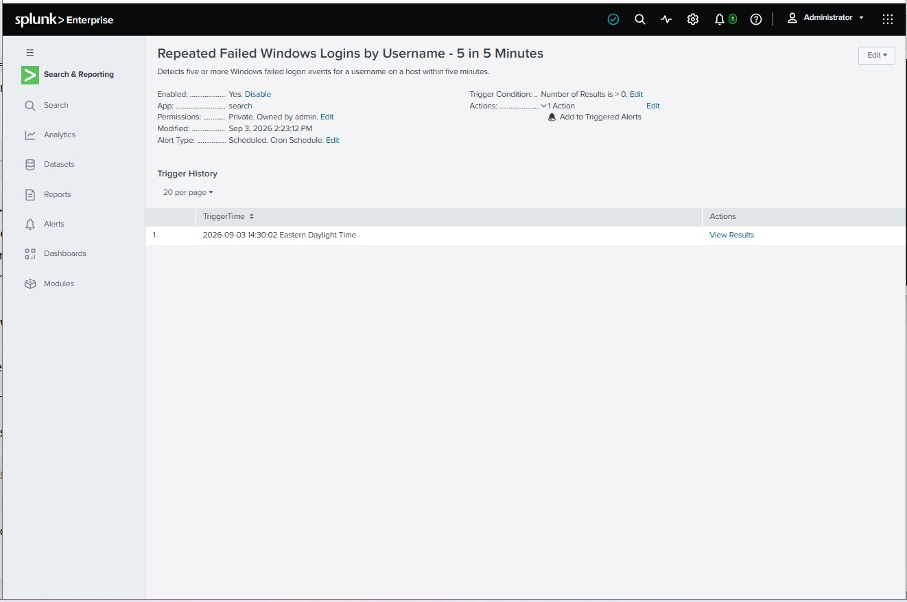
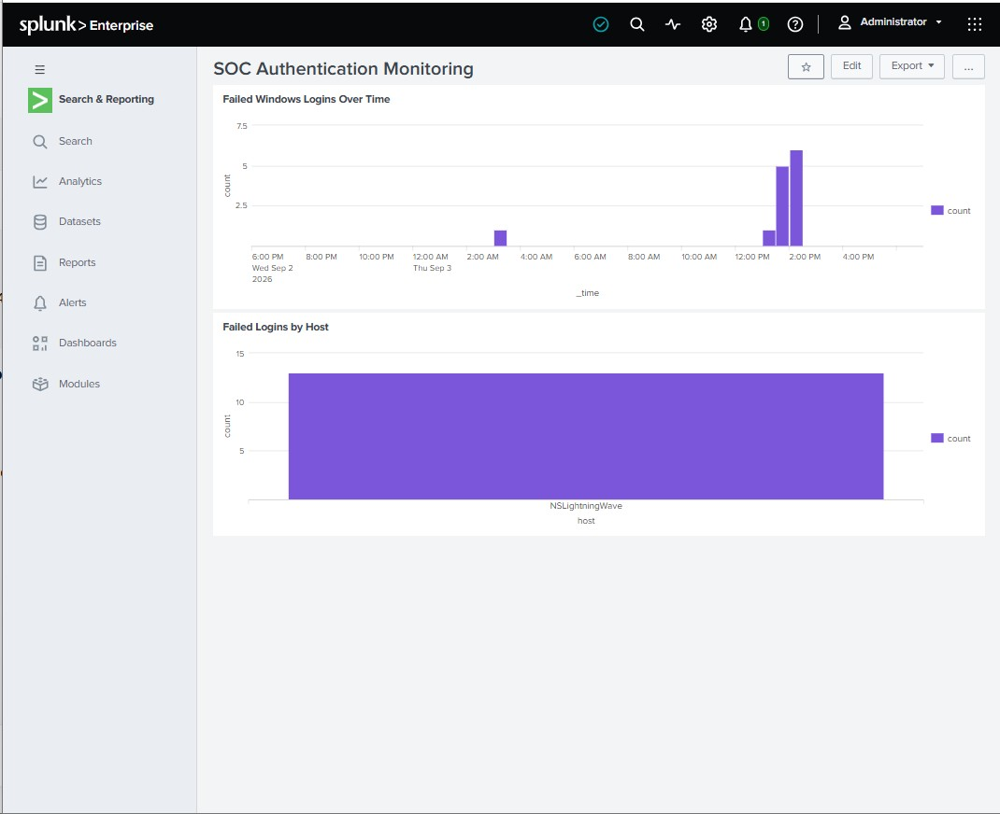
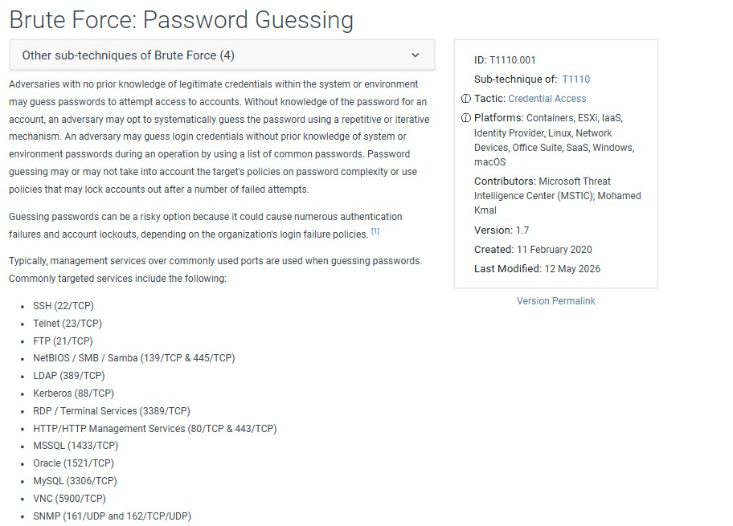
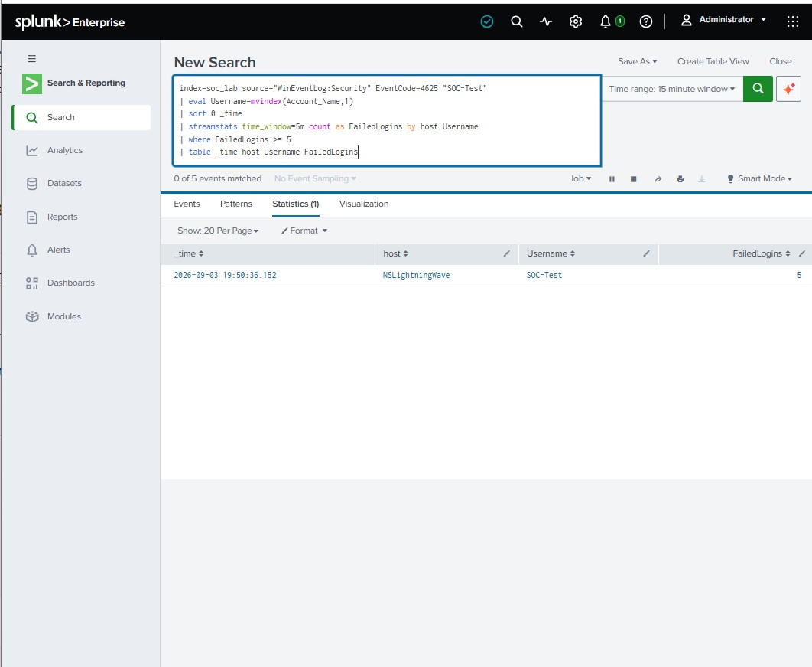

## Project Artifacts

- [SOC Incident Report - PDF](incident-report/SOC-Incident-Report.pdf)
- [SOC Incident Report - DOCX](incident-report/SOC-Incident-Report.docx)
- [Failed Login Detection SPL Query](spl-queries/failed-login-detection.spl)
- [Full Screenshot Evidence](screenshots/)
- [Lessons Learned](lessons-learned/)

## Selected Evidence

### Windows Security Event ID 4625

### Failed Login Activity in Splunk

### SPL Detection Query

### Splunk Alert

### SOC Authentication Monitoring Dashboard

### MITRE ATT&CK Mapping

### Detection Validation

