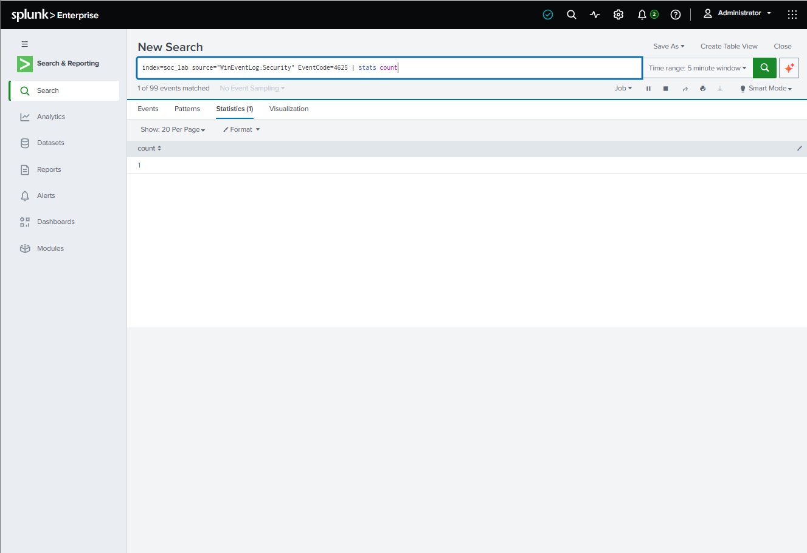

# SOC Analyst Splunk Investigation Lab

**Windows Failed Authentication Detection, Investigation, and Validation**

[](LICENSE)


## TL;DR

I built an authorized Windows 11 SOC lab using Sysmon, Windows Security logs, and Splunk. I generated repeated failed logons against a test account, created an SPL rule to detect 5+ Event ID 4625 failures within 5 minutes, saved it as an alert, built an authentication dashboard, mapped the behavior to MITRE ATT&CK T1110.001, and validated the detection with a second test. The report documents exactly what the evidence does and does not prove.

## Environment

| Component | Value |
|---|---|
| OS | Windows 11 Pro 25H2 (Build 26200.9278) |
| Host | NSLightningWave |
| Test account | SOC-Test |
| Telemetry | Windows Security Event Log, Sysmon |
| SIEM | Splunk Enterprise |
| Index | `soc_lab` |
| Event | Windows Event ID 4625 |
| MITRE ATT&CK | T1110.001 — Password Guessing |

## Detection Question

Can Splunk reliably identify at least five Windows failed authentication events for a host/user within a five-minute window and provide enough evidence for a SOC analyst to investigate?

## SPL Detection Logic

**Baseline:**
```spl
index=soc_lab EventCode=4625 | bin _time span=5m | stats count by _time host | where count >= 5
```

**Username-aware:**
```spl
index=soc_lab source="WinEventLog:Security" EventCode=4625
| eval Username=mvindex(Account_Name,1)
| bin _time span=5m
| stats count by _time host Username
| where count >= 5
```

**Rolling validation:**
```spl
index=soc_lab source="WinEventLog:Security" EventCode=4625 "SOC-Test"
| eval Username=mvindex(Account_Name,1)
| sort 0 _time
| streamstats time_window=5m count as FailedLogins by host Username
| where FailedLogins >= 5
| table _time host Username FailedLogins
```

## Finding

- **Event ID:** 4625
- **Host:** NSLightningWave
- **Target account:** SOC-Test
- **Failure reason:** Unknown user name or bad password
- **Source address:** `::1` (IPv6 loopback)
- **Threshold:** ≥ 5 failures in 5 minutes
- **Alert:** triggered
- **Dashboard:** populated
- **Validation:** reproduced with a second test

## Evidence

### Windows Event ID 4625


### Splunk Failed Logins


### Detection Query


### Splunk Alert


### SOC Dashboard


### MITRE ATT&CK T1110.001


### Detection Validation


### Negative Test Evidence


## MITRE ATT&CK Mapping

**T1110.001 — Password Guessing** (Credential Access)

Repeated failed logons against a single account in a short window are consistent with password guessing behavior. This project maps the observed behavior, not a confirmed adversary.

## Risk Assessment

- **Lab risk:** Low — activity was authorized, local, and intentional.
- **Analytical priority:** Medium — repeated failures can indicate password guessing or credential misuse.
- **No CVSS score:** This is a behavior-based detection use case, not a software vulnerability.

## Remediation Recommendations

- Enable multi-factor authentication (MFA)
- Enforce a strong password policy
- Tune account lockout controls
- Monitor repeated authentication failures
- Investigate suspicious source addresses
- Restrict unnecessary remote access
- Configure SIEM alerts and dashboards
- Review affected user accounts

## What Was Not Proven

- No real threat actor was identified.
- No successful credential compromise was demonstrated.
- No external source was proven (`::1` is loopback).
- No lateral movement, privilege escalation, persistence, or exfiltration was observed.
- Event ID 4625 alone does not prove intent.
- No production remediation controls were implemented.

## Validation

Repeated the test after the initial investigation. The rolling five-minute query returned `FailedLogins = 5` for `SOC-Test` on `NSLightningWave`. **Result: PASS.**

Negative test: a single failed logon returned count = 1 and did **not** trigger the ≥ 5 threshold.

## 30-Second Recruiter Summary

I built an authorized Windows SOC lab using Sysmon, Windows Security logs, and Splunk. I generated repeated failed logons against a test account, created an SPL rule to detect 5+ Event ID 4625 failures within 5 minutes, enriched the rule with username data, saved it as an alert, built an authentication dashboard, mapped the behavior to MITRE ATT&CK T1110.001, and repeated the test to validate the detection. The report documents what the evidence does and does not prove.

## Repository Structure

```
├── README.md
├── LICENSE
├── incident-report/       # Full markdown report + PDF/DOCX
├── spl-queries/           # SPL detection queries
├── screenshots/           # Evidence (numbered)
└── lessons-learned/       # Technical and analytical takeaways
```

## Disclaimer

This project was conducted in an authorized personal cybersecurity lab for educational and defensive security purposes. No unauthorized systems, accounts, or third-party environments were targeted.
